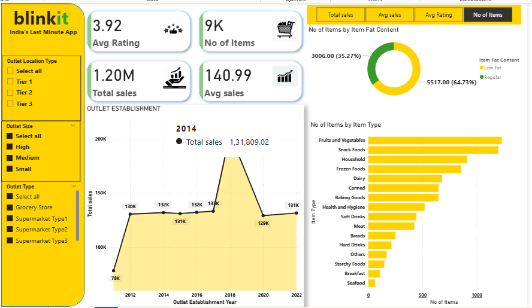

# 🛒 Blinkit Grocery Dashboard - Power BI Analysis

This project presents an interactive Power BI dashboard analyzing Blinkit's grocery sales data, focusing on item performance, outlet types, and customer preferences.

---

## 📁 Dataset Used

- Source: BlinkIt Grocery Dataset
- File: `BlinkIt grocery Dataset.xlsx`
- Fields include:
  - Item Type
  - Item Fat Content
  - Outlet Location Type (Tier 1, Tier 2, Tier 3)
  - Outlet Size (Small, Medium, High)
  - Outlet Type (Grocery Store, Supermarket Types)
  - Total Sales, Avg Sales, Avg Rating
  - Item Visibility
  - Outlet Establishment Year

---

## 🎯 Dashboard KPIs (Top Cards)

- **Average Rating:** `3.92`
- **Number of Items:** `9K`
- **Total Sales:** `1.20M`
- **Average Sales per Item:** `140.99`

---

## 📊 Visualizations Used

### 1. 🔲 KPI Cards
- Metrics:
  - Avg Rating
  - Total Sales
  - Avg Sales
  - No of Items

### 2. 🟡 Donut Chart: Item Fat Content
- Distribution of items between:
  - Low Fat (35.27%)
  - Regular (64.73%)

### 3. 📈 Area Chart: Outlet Establishment Year vs Total Sales
- Time series analysis from 2010 to 2022
- Peak sales around 2018 (`1,96K`)

### 4. 📊 Horizontal Bar Chart: No of Items by Item Type
- Top categories by volume:
  - Fruits and Vegetables
  - Snack Foods
  - Household
  - Frozen Foods

### 5. 🔀 Toggle Buttons (Bookmarks)
- Allow switching between:
  - Total Sales
  - Average Sales
  - Average Rating
  - No of Items

---

## 🎛️ Filters / Slicers

### 1. 🏬 Outlet Location Type
- Tier 1
- Tier 2
- Tier 3

### 2. 🧱 Outlet Size
- Small
- Medium
- High

### 3. 🏪 Outlet Type
- Grocery Store
- Supermarket Type1
- Supermarket Type2
- Supermarket Type3

---
## Dashboard Screenshot

## 📌 Key Insights

- Most items are in the **Regular fat content** category.
- **Fruits and Vegetables** lead in the number of items stocked.
- **Outlet establishment around 2018** had the highest total sales (~196K).
- A relatively high **average item rating (3.92)** indicates general customer satisfaction.
- **Tier 2 and Tier 3 locations** have significant sales activity.
- Supermarket types have **broad inventory** across item types.

---

## ✅ Features Implemented

- Bookmark Navigation (Toggle Analysis Mode)
- Custom Tooltip for Establishment Year with sales
- Slicer panels with multi-selection
- Conditional formatting on bar charts
- Donut chart % labels
- Clean yellow/black Blinkit theme branding

---

## 📌 Future Enhancements (Suggested)

- Add Customer Segmentation Heatmap
- Add Sales Forecast using Time Intelligence
- Add Sales vs Visibility Scatter Analysis
- Implement Geo Map (if region/city is available)
- Introduce What-If Top-N slicer for items

---

## 🛠 Tools & Technologies

- **Power BI Desktop**
- **Excel Data Model**
- **DAX for calculations & measures**
- **Bookmarks & Selection Pane**
- **Custom Theme Colors**

---

---

## 👨‍💻 Created By

- BlinkIt Dashboard by Shanmukhi koshireddy
